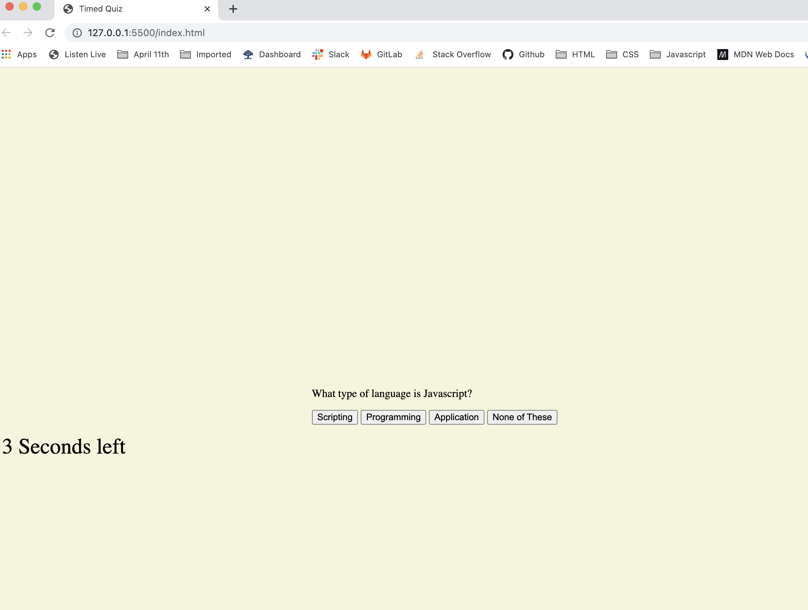
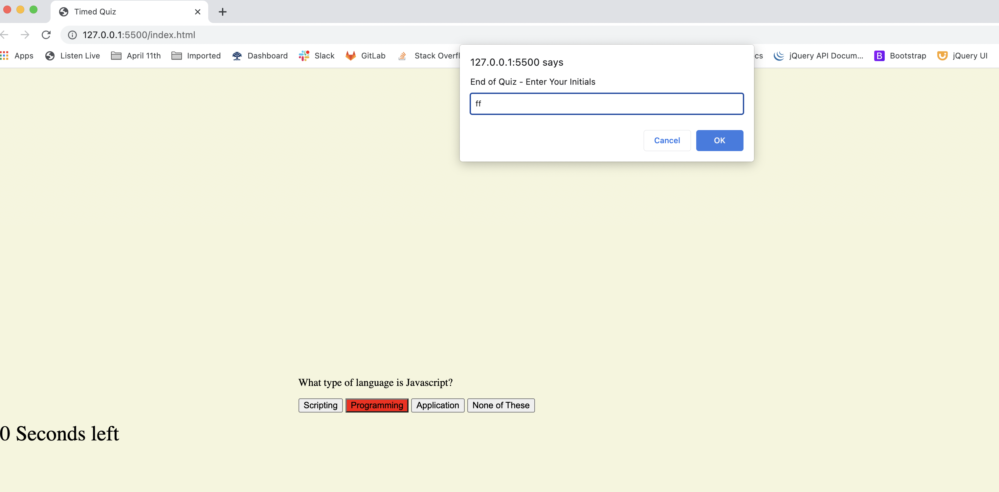

# TimedQuiz

This webpage launches a timed coding quiz with multiple-choice questions. Running in the browser this features dynamically updated HTML and CSS powered by JavaScript written by Link.

The quiz includes a timer which gains time when a question is answered correctly and loses time when a question is answered incorrectly, when the timer runs out of time or all questions are finished the game is over and the user is able to submit initials and score. Initial score and highest scores are stored in local storage.

Deployment link: 

https://linklg1.github.io/TimedQuiz/

Screenshots: 

